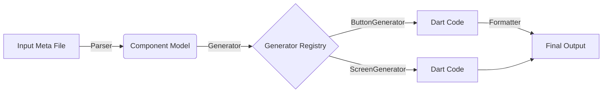

# Architecture & Design Philosophy

**Syntaxify** is a statically-typed, compile-time UI generator for Flutter. It automates valid, lint-free Flutter code creation from strongly-typed specifications.

## 1. Core Philosophy

### 1.1 Compile-Time > Runtime
Syntaxify intentionally avoids a "runtime engine" (like `ServerDrivenUI` iterating over JSON maps).
- **Zero Runtime Cost**: Generated code is just standard Flutter widgets (`Column`, `Row`, `Text`).
- **Tree Shaking**: Unused components are stripped by the Dart compiler.
- **Debugging**: You debug real Dart code, not a black-box engine.

### 1.2 Annotations as Source of Truth
We use standard Dart classes annotated with `@SyntaxComponent` as standard-bearers for specifications.
- **Why?** It leverages the Dart Analyzer for free. We don't write a custom parser for a `.yaml` or `.json` DSL.
- **Type Safety**: If your spec doesn't compile (e.g., `variant: 'primary'` text instead of enum), the generator never runs.

### 1.3 `build_runner` Independence
Syntaxify is a standalone CLI tool, not a `build_runner` plugin.
- **Performance**: `build_runner` is notoriously slow for large projects as it rebuilds the entire graph.
- **Flexibility**: We can run `syntaxify build --watch` on just the input files we care about, with sub-second incremental rebuilds using our custom `BuildCacheManager`.

---

## 2. System Overview

The data flow is linear and unidirectional:



### 2.1 The Parser (`MetaParser`)
- Reads `.meta.dart` files using `package:analyzer`.
- Extracts:
  - Class name & fields (Inputs)
  - Documentation comments
  - `@Variant` annotations
- **Output**: `ComponentDefinition` (agnostic of UI implementation).

### 2.2 The Model (`LayoutNode`)
For Screens, we parse a recursive AST representing the UI layout.
- `ColumnNode` / `RowNode`: Layout containers.
- `TextNode` / `ButtonNode`: Leaf widgets.
- `TextFieldNode`: Interactive inputs.
- **Validation**: All nodes pass through `LayoutValidator` before generation (detects invalid nesting, bad constraints).

### 2.3 The Generators (`ComponentGenerator`)
Each component type (Button, Screen, etc.) has a dedicated generator.
- **Renderer Pattern**: Components like `AppButton` delegate their *look* to a `DesignStyle` typically found in `design_system.dart`.
- **Logic**: `ScreenGenerator` wires up `void function` fields in the spec to `VoidCallback` parameters in the implementation.

### 2.4 The Emitter (`DartEmitter` + `code_builder`)
We generates ASTs, not string templates.
- **Correctness**: Impossible to generate unbalanced braces or missing imports.
- **Formatting**: All output passes through `dart_style` (the engine behind `dart format`).

---

## 3. Key Decisions & Trade-offs

| Decision               | Benefit                              | Drawback                              |
| :--------------------- | :----------------------------------- | :------------------------------------ |
| **No Runtime Library** | Max performance, simple debugging    | Larger binary size (boilerplate code) |
| **Dart AST for Input** | Type-safe inputs, IDE autocompletion | Users must write valid Dart classes   |
| **Custom CLI**         | Fast incremental builds              | One more tool to install/run          |
| **Renderer Pattern**   | Centralized styling                  | Indirection in generated code         |

## 4. Directory Structure

```text
lib/
├── syntaxify/          # Generated Code Root
│   ├── components/     # Generated atomic components (AppButton)
│   ├── screens/        # Generated screens (LoginScreen)
│   ├── design_system/  # (User-managed) Theming & Styles
│   └── index.dart      # Barrel file for imports
└── meta/               # (Input) Your Component Specs
```
