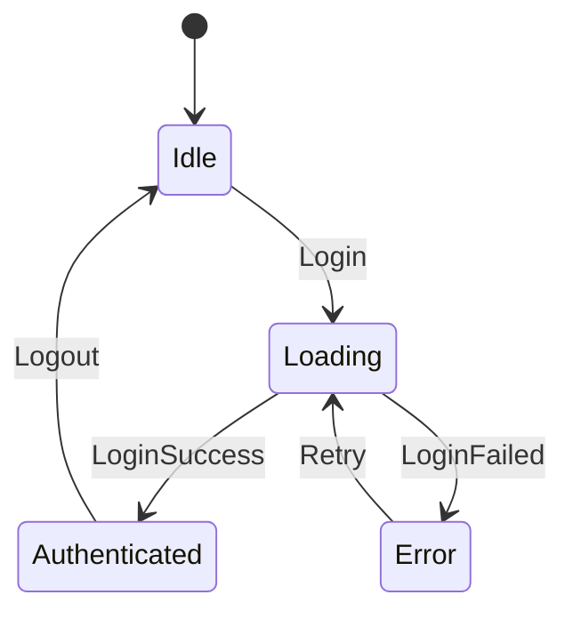

# State Machine Compiler: Scope Expansion Analysis

**Purpose:** Identify missing features and capabilities to make the state machine compiler production-complete.

**Current Status:** Core implementation planned (7 sessions)
**This Document:** Identifies gaps and expansion opportunities

---

## 🔍 Gap Analysis

### Current Plan Coverage (MVP)

✅ **Core Features (Sessions 1-7)**
- Feature definition DSL
- State/Intent sealed class generation
- Engine with pure reducer
- Effect execution framework
- Flutter integration (Provider/Builder)
- Basic validation (unknown states, ambiguous transitions)
- Unit/integration/golden tests

**What's Missing:** 80% of production needs

---

## 📊 Missing Capabilities (Categorized by Impact)

### 🔴 CRITICAL (Must Have for Production)

#### 1. State Machine Visualization
**Gap:** No way to see state machine structure visually

**Need:**
```dart
// Generate state diagram from feature definition
syntaxify diagram booking.feature.dart
// Output: booking_state_machine.svg
```

**Generates:**


**Impact:** HIGH - Essential for understanding complex flows

**Effort:** Session 8 (3-4h)
- Parse feature definition
- Build graph structure
- Generate Mermaid/DOT/SVG
- CLI command integration

**Libraries:**
- `mermaid` (diagram syntax)
- `graphviz` (DOT rendering)
- `plantuml` (state diagrams)

---

#### 2. Time-Travel Debugging
**Gap:** Can record intents but no replay UI

**Need:**
```dart
// DevTools panel showing:
// - Intent timeline
// - State at each step
// - Ability to replay from any point
// - Jump to specific state
```

**Implementation:**
```dart
class DebugEngine<S, I> extends Engine<S, I> {
  final List<IntentRecord<I>> _history = [];

  @override
  void dispatch(I intent) {
    _history.add(IntentRecord(
      intent: intent,
      timestamp: DateTime.now(),
      previousState: state,
    ));
    super.dispatch(intent);
  }

  void replayTo(int index) {
    var state = initialState;
    for (var i = 0; i <= index; i++) {
      final result = reduce(state, _history[i].intent);
      state = result.state;
    }
    _state = state;
    notifyListeners();
  }
}
```

**Impact:** HIGH - Game changer for debugging

**Effort:** Session 9-10 (6-8h)
- Debug wrapper engine
- Intent recording
- Replay mechanism
- DevTools integration
- UI panel

---

#### 3. State Persistence (Hydration/Rehydration)
**Gap:** State lost on app restart

**Need:**
```dart
// Auto-save state to storage
BookingEngine(
  persistenceKey: 'booking_state',
  storage: SharedPreferences,
);

// On app restart, restore state
final engine = await BookingEngine.restore();
```

**DSL Extension:**
```dart
FeatureDefinition(
  name: 'Booking',
  persistence: PersistenceConfig(
    key: 'booking',
    storage: StorageType.localStorage,
    serializeState: true,
  ),
  // ...
)
```

**Generated Code:**
```dart
class BookingEngine extends Engine<BookingState, BookingIntent> {
  Future<void> saveState() async {
    final json = _state.toJson();
    await storage.setString('booking_state', jsonEncode(json));
  }

  static Future<BookingEngine> restore() async {
    final json = await storage.getString('booking_state');
    final state = json != null
      ? BookingState.fromJson(jsonDecode(json))
      : BookingIdle();
    return BookingEngine(initialState: state);
  }
}
```

**Impact:** HIGH - Critical for real apps (shopping cart, forms, etc.)

**Effort:** Session 11-12 (6-8h)
- Add persistence to DSL
- Generate toJson/fromJson for states
- Auto-save on state change
- Restore on engine init
- Migration support (version changes)

---

#### 4. Middleware System
**Gap:** No hooks for cross-cutting concerns

**Need:**
```dart
// Logging middleware
class LoggingMiddleware extends Middleware {
  @override
  void onIntent(Intent intent, State state) {
    print('Intent: $intent from state: $state');
  }

  @override
  void onStateChange(State oldState, State newState) {
    print('State: $oldState -> $newState');
  }
}

// Analytics middleware
class AnalyticsMiddleware extends Middleware {
  @override
  void onIntent(Intent intent, State state) {
    analytics.track('intent_${intent.runtimeType}');
  }
}

// Engine with middleware
BookingEngine(
  middleware: [
    LoggingMiddleware(),
    AnalyticsMiddleware(),
    ErrorTrackingMiddleware(),
  ],
);
```

**Generated Engine:**
```dart
class BookingEngine extends Engine<BookingState, BookingIntent> {
  final List<Middleware> middleware;

  @override
  void dispatch(Intent intent) {
    // Pre-dispatch hooks
    for (final mw in middleware) {
      mw.onIntent(intent, state);
    }

    final oldState = state;
    final result = reduce(state, intent);
    _state = result.state;

    // Post-dispatch hooks
    for (final mw in middleware) {
      mw.onStateChange(oldState, _state);
    }

    notifyListeners();
  }
}
```

**Impact:** HIGH - Essential for logging, analytics, error tracking

**Effort:** Session 13 (4-5h)
- Middleware interface
- Hook points (pre-intent, post-state, on-error)
- Built-in middleware (logging, analytics)
- User custom middleware support

---

### 🟡 HIGH PRIORITY (Needed Soon)

#### 5. Advanced Validation
**Current:** Basic validation (unknown states, ambiguous transitions)

**Missing Validations:**

**5.1 Unreachable Code Detection**
```dart
// Detect intents that are never used
IntentDefinition('NeverFired'), // ⚠️ WARNING: Intent never referenced

// Detect states that are unreachable
StateDefinition('Orphan'), // ⚠️ WARNING: No transitions lead here
```

**5.2 Dead-End States**
```dart
StateDefinition('Terminal'), // ⚠️ WARNING: No way out of this state
// (Unless intended as final state)
```

**5.3 Circular Dependency Detection**
```dart
Transition(from: 'A', on: 'Go', to: 'B'),
Transition(from: 'B', on: 'Go', to: 'A'),
// ⚠️ WARNING: Infinite loop possible (A ↔ B)
```

**5.4 Field Compatibility**
```dart
StateDefinition('Selected', fields: [
  Field('service', 'Service'),
]),

Transition(
  from: 'Idle',
  on: 'Select',
  to: 'Selected',
  // ❌ ERROR: 'Selected' requires 'service' field
  // But 'Select' intent doesn't provide it
)
```

**5.5 Type Safety**
```dart
Field('count', 'int', defaultValue: '"hello"')
// ❌ ERROR: Default value type mismatch (String vs int)
```

**Impact:** MEDIUM-HIGH - Catches bugs at compile time

**Effort:** Session 14 (4-5h)
- Implement 10+ validation rules
- Create ValidationEngine
- Report helpful error messages
- Suggest fixes

---

#### 6. Guarded Transitions
**Gap:** Can't conditionally allow transitions

**Current:**
```dart
Transition(from: 'FormInput', on: 'Submit', to: 'Submitting')
// Always transitions, even if form invalid
```

**Need:**
```dart
Transition(
  from: 'FormInput',
  on: 'Submit',
  to: 'Submitting',
  guard: 'isFormValid', // Only transition if guard returns true
)

// Generated code:
case (FormInput() state, Submit() intent) => {
  if (_guards.isFormValid(state, intent)) {
    return ReduceResult(Submitting(), [/*...*/]);
  }
  return ReduceResult(state); // Stay in FormInput
}
```

**User implements:**
```dart
class BookingGuards extends Guards<BookingState, BookingIntent> {
  bool isFormValid(FormInput state, Submit intent) {
    return state.email.isNotEmpty && state.password.length >= 8;
  }
}

BookingEngine(guards: BookingGuards());
```

**Impact:** MEDIUM-HIGH - Common pattern for complex flows

**Effort:** Session 15 (3-4h)
- Add guard field to TransitionDefinition
- Generate guard interface
- User implements guards
- Engine checks guards before transition

---

#### 7. Computed States (Derived State)
**Gap:** Can't derive state from other state

**Need:**
```dart
StateDefinition(
  'Cart',
  fields: [
    Field('items', 'List<CartItem>'),
    Field.computed('total', 'double', from: 'items', compute: 'calculateTotal'),
    Field.computed('isEmpty', 'bool', from: 'items', compute: 'items.isEmpty'),
  ],
)
```

**Generated:**
```dart
class Cart extends CartState {
  final List<CartItem> items;

  const Cart({required this.items});

  // Computed fields (getters)
  double get total => items.fold(0, (sum, item) => sum + item.price);
  bool get isEmpty => items.isEmpty;
}
```

**Impact:** MEDIUM - Reduces duplication, enforces consistency

**Effort:** Session 16 (2-3h)
- Add Field.computed() to DSL
- Generate getters in state classes
- Validate computed expressions

---

#### 8. Effect Enhancements

**8.1 Effect Debouncing**
```dart
Transition(
  from: 'SearchInput',
  on: 'TypeCharacter',
  to: 'SearchInput',
  effects: [
    Custom('searchAPI').debounce(Duration(milliseconds: 300)),
  ],
)
```

**8.2 Effect Throttling**
```dart
Transition(
  from: 'MapView',
  on: 'Pan',
  to: 'MapView',
  effects: [
    Custom('updateView').throttle(Duration(milliseconds: 100)),
  ],
)
```

**8.3 Effect Cancellation**
```dart
Transition(
  from: 'Loading',
  on: 'Cancel',
  to: 'Idle',
  effects: [
    CancelEffect('loadData'), // Cancel in-flight effect
  ],
)
```

**8.4 Parallel Effects**
```dart
effects: [
  Parallel([
    Custom('loadProfile'),
    Custom('loadSettings'),
    Custom('loadNotifications'),
  ]),
]
```

**Impact:** MEDIUM - Common patterns in real apps

**Effort:** Session 17 (4-5h)
- Add effect modifiers (debounce, throttle, cancel)
- Implement effect scheduler
- Track in-flight effects
- Cancellation mechanism

---

#### 9. Nested State Machines
**Gap:** Can't compose state machines

**Need:**
```dart
FeatureDefinition(
  name: 'Checkout',
  states: [
    StateDefinition('ShippingStep',
      nestedMachine: 'AddressForm',
    ),
    StateDefinition('PaymentStep',
      nestedMachine: 'PaymentForm',
    ),
  ],
)
```

**Generated:**
```dart
class CheckoutEngine extends Engine<CheckoutState, CheckoutIntent> {
  final AddressFormEngine _addressEngine = AddressFormEngine();
  final PaymentFormEngine _paymentEngine = PaymentFormEngine();

  @override
  ReduceResult<CheckoutState> reduce(CheckoutState state, CheckoutIntent intent) {
    // Delegate to nested engine if in nested state
    if (state is ShippingStep) {
      if (intent is AddressFormIntent) {
        _addressEngine.dispatch(intent);
        return ReduceResult(state);
      }
    }
    // ... regular transitions
  }
}
```

**Impact:** MEDIUM - Enables modular design

**Effort:** Session 18-19 (6-8h)
- Add nested machine support to DSL
- Generate nested engine delegation
- Event bubbling from nested to parent
- State composition

---

### 🟢 NICE TO HAVE (Future Enhancements)

#### 10. VS Code Extension
**Features:**
- Syntax highlighting for `.feature.dart`
- Autocomplete for states/intents
- Inline state diagram preview
- Quick actions (add state, add transition)
- Refactoring (rename state, extract transition)

**Impact:** LOW-MEDIUM - Better DX

**Effort:** 2-3 weeks
- TextMate grammar
- Language server protocol
- Extension API

---

#### 11. State Migration System
**Gap:** No versioning when state schema changes

**Need:**
```dart
FeatureDefinition(
  name: 'Booking',
  version: 2,
  migrations: [
    Migration(
      from: 1,
      to: 2,
      migrate: 'migrateV1ToV2',
    ),
  ],
)

// User implements:
BookingState migrateV1ToV2(Map<String, dynamic> oldState) {
  return BookingState(
    service: oldState['service'],
    slot: DateTime.parse(oldState['date']), // Renamed field
  );
}
```

**Impact:** LOW-MEDIUM - Needed for evolving apps

**Effort:** Session 20 (3-4h)

---

#### 12. Cross-Feature Communication
**Gap:** Features can't talk to each other

**Need:**
```dart
// Booking feature emits event
effects: [
  EmitEvent('booking_complete', data: booking),
]

// Cart feature listens
FeatureDefinition(
  name: 'Cart',
  listeners: [
    Listen('booking_complete', trigger: 'AddToCart'),
  ],
)
```

**Impact:** LOW-MEDIUM - Multi-feature coordination

**Effort:** Session 21 (4-5h)

---

#### 13. Code Generation Enhancements

**13.1 Equatable Integration**
```dart
class BookingIdle extends BookingState with EquatableMixin {
  @override
  List<Object?> get props => [];
}
```

**13.2 JSON Serialization**
```dart
class ServiceSelected extends BookingState {
  final Service service;

  Map<String, dynamic> toJson() => {'service': service.toJson()};
  factory ServiceSelected.fromJson(Map<String, dynamic> json) =>
    ServiceSelected(service: Service.fromJson(json['service']));
}
```

**13.3 CopyWith Methods**
```dart
class ServiceSelected extends BookingState {
  final Service service;

  ServiceSelected copyWith({Service? service}) {
    return ServiceSelected(service: service ?? this.service);
  }
}
```

**Impact:** LOW - Quality of life

**Effort:** Session 22 (3-4h)

---

#### 14. Testing Harness Generator
**Gap:** No test scaffolding

**Generate:**
```dart
// booking_engine_test.dart (auto-generated)
void main() {
  group('BookingEngine', () {
    late BookingEngine engine;

    setUp(() {
      engine = BookingEngine();
    });

    test('Initial state is Idle', () {
      expect(engine.state, isA<BookingIdle>());
    });

    // Generate test for each transition
    test('SelectService transitions to ServiceSelected', () {
      engine.dispatch(SelectService(massage));
      expect(engine.state, isA<ServiceSelected>());
      expect((engine.state as ServiceSelected).service, massage);
    });

    // Generate test for each effect
    test('ConfirmBooking triggers StartBooking effect', () {
      // ... setup
      engine.dispatch(ConfirmBooking());
      expect(engine.executedEffects, contains(Custom('StartBooking')));
    });
  });
}
```

**Impact:** MEDIUM - Ensures quality

**Effort:** Session 23 (4-5h)

---

#### 15. Documentation Generator
**Gap:** No auto-docs for features

**Generate:**
```markdown
# Booking Feature

## States

- **Idle**: Initial state
- **ServiceSelected**: User selected a service
  - Fields: `service: Service`
- **ScheduleSelected**: User selected time slot
  - Fields: `service: Service, slot: DateTime`

## Intents

- **SelectService**: User selects a service
  - Inputs: `service: Service`
- **SelectSchedule**: User selects time slot
  - Inputs: `slot: DateTime`

## Transitions

| From | On | To | Effects |
|------|----|----|---------|
| Idle | SelectService | ServiceSelected | Navigate('/schedule') |
| ServiceSelected | SelectSchedule | ScheduleSelected | Navigate('/confirm') |

## State Diagram

[Embedded Mermaid diagram]
```

**Impact:** LOW-MEDIUM - Better docs

**Effort:** Session 24 (3-4h)

---

#### 16. Migration Tools (From Other State Management)

**16.1 From Bloc**
```dart
// Convert Bloc to Feature Definition
syntaxify migrate bloc booking_bloc.dart
```

**16.2 From Riverpod**
```dart
syntaxify migrate riverpod booking_provider.dart
```

**Impact:** LOW - Helps adoption

**Effort:** 1-2 weeks per tool

---

## 📊 Prioritized Roadmap

### Phase 1: MVP (Sessions 1-7) - ALREADY PLANNED ✅
**Duration:** 2-3 weeks
**Deliverables:** Core state machine compiler working

---

### Phase 2: Production Essentials (Sessions 8-13)
**Duration:** 2-3 weeks
**Must-Have Features:**

| Session | Feature | Effort | Impact |
|---------|---------|--------|--------|
| 8 | State Visualization | 3-4h | HIGH |
| 9-10 | Time-Travel Debugging | 6-8h | HIGH |
| 11-12 | State Persistence | 6-8h | HIGH |
| 13 | Middleware System | 4-5h | HIGH |

**Total:** ~20-25 hours

---

### Phase 3: Advanced Features (Sessions 14-19)
**Duration:** 3-4 weeks
**High-Value Features:**

| Session | Feature | Effort | Impact |
|---------|---------|--------|--------|
| 14 | Advanced Validation | 4-5h | HIGH |
| 15 | Guarded Transitions | 3-4h | MED-HIGH |
| 16 | Computed States | 2-3h | MEDIUM |
| 17 | Effect Enhancements | 4-5h | MEDIUM |
| 18-19 | Nested State Machines | 6-8h | MEDIUM |

**Total:** ~20-25 hours

---

### Phase 4: Developer Experience (Sessions 20-24)
**Duration:** 2-3 weeks
**Nice-to-Have Features:**

| Session | Feature | Effort | Impact |
|---------|---------|--------|--------|
| 20 | State Migration | 3-4h | MED |
| 21 | Cross-Feature Comm | 4-5h | MED |
| 22 | Codegen Enhancements | 3-4h | LOW-MED |
| 23 | Testing Harness | 4-5h | MED |
| 24 | Docs Generator | 3-4h | LOW-MED |

**Total:** ~17-22 hours

---

### Phase 5: Ecosystem (Separate Track)
**Duration:** 2-3 months
**Long-term Investments:**

- VS Code Extension (2-3 weeks)
- Migration Tools (1-2 weeks per tool)
- Advanced Examples (1-2 weeks)
- Video Tutorials (1-2 weeks)
- Conference Talks (ongoing)

---

## 🎯 Recommended Scope for v1.0

### Include (Critical Path)
1. ✅ Core compiler (Sessions 1-7)
2. ✅ State visualization (Session 8)
3. ✅ Time-travel debugging (Sessions 9-10)
4. ✅ State persistence (Sessions 11-12)
5. ✅ Middleware system (Session 13)
6. ✅ Advanced validation (Session 14)
7. ✅ Guarded transitions (Session 15)

**Total:** ~15 sessions (~50-60 hours) = 6-8 weeks

**Result:** Production-ready state machine compiler

---

### Defer to v1.1 (Post-Launch)
- Computed states
- Effect enhancements
- Nested state machines
- State migration
- Cross-feature communication
- Code generation enhancements
- Testing harness
- Documentation generator

**Reason:** Nice-to-have, can ship without them

---

### Defer to v2.0 (Long-term)
- VS Code extension
- Migration tools
- Advanced examples
- Video tutorials

**Reason:** Ecosystem features, need user base first

---

## 📈 Impact vs Effort Matrix

```
HIGH IMPACT
│
│  Time-Travel     State Viz
│  Debugging       │
│      │           │
│      │   Middleware
│      │     │
│  Persistence    Advanced
│      │         Validation
│  Guarded        │
│  Transitions    │
│      │          │
│      │   Computed    Effect
│      │   States     Enhancements
│      │     │           │
│      │     │   Nested  │
│      │     │   Machines│
│      │     │     │     │
│      │     │     │  Testing
│      │     │     │  Harness
│      │     │     │     │
│      │  State    │  Codegen
│      │  Migration│  Enhance
│      │     │     │     │
│      │     │  Docs Gen │
│      │     │     │  Cross-Feature
│      │     │     │  Communication
│      │     │     │     │
│──────┼─────┼─────┼─────┼──────→ EFFORT
     2-3h   4-5h  6-8h  10h+
```

**Sweet Spot:** High impact, 4-8h effort
- Time-travel debugging
- State visualization
- Middleware system
- State persistence
- Advanced validation

---

## 🚀 Updated Total Scope

### Original Plan (MVP)
- **Sessions:** 1-7
- **Effort:** ~25 hours
- **Duration:** 2-3 weeks

### Expanded Plan (Production-Ready v1.0)
- **Sessions:** 1-15
- **Effort:** ~60 hours
- **Duration:** 6-8 weeks

### Complete Vision (v2.0)
- **Sessions:** 1-24+
- **Effort:** ~100 hours
- **Duration:** 3-4 months

---

## 💡 Recommendations

### For Immediate Start
**Stick with MVP (Sessions 1-7)**
- Get working prototype fast
- Validate with users
- Learn what's truly needed

### After User Feedback
**Add Production Essentials (Sessions 8-13)**
- Based on what users request most
- Focus on biggest pain points
- Don't over-engineer

### For v1.0 Release
**Include Critical Features (Sessions 1-15)**
- Visualization (must-see)
- Time-travel (killer feature)
- Persistence (table stakes)
- Middleware (extensibility)
- Validation (confidence)
- Guards (flexibility)

---

## 📝 Next Steps

1. **Review** this expansion analysis
2. **Decide** scope for v0.3.0-alpha (MVP only or MVP + essentials?)
3. **Update** IMPLEMENTATION_PLAN.md if expanding scope
4. **Prioritize** based on your timeline and resources
5. **Execute** session by session

**Key Decision:** Ship fast (MVP in 2-3 weeks) or ship complete (v1.0 in 6-8 weeks)?

Both are valid strategies. Choose based on your goals.
