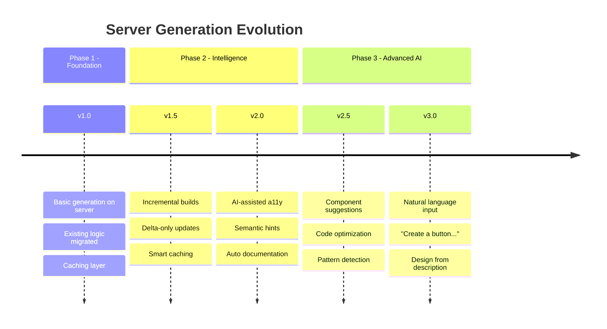
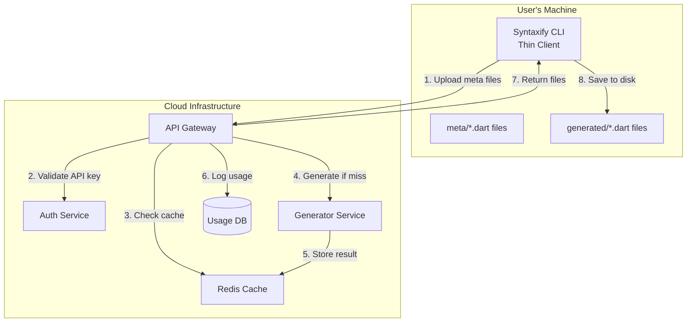
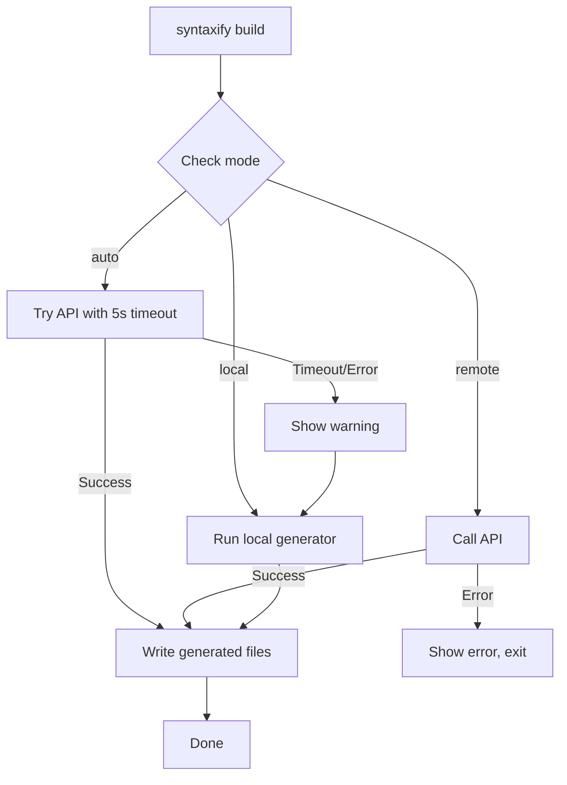

# Server-Side Generation Architecture (GaaS)

> **Generation as a Service** - Move code generation to the cloud while keeping the CLI as a thin client.

## Executive Summary

Transform Syntaxify from a local CLI tool into a hybrid system where:
- **CLI (pub.dev)** = Thin client that uploads meta files and downloads generated code
- **Server (private)** = Runs all generation logic, protected IP, instant updates

```
┌──────────────┐     POST /build      ┌──────────────┐
│   CLI        │ ──────────────────►  │   Server     │
│  (pub.dev)   │   meta files + cfg   │  (private)   │
│              │ ◄──────────────────  │              │
│  thin client │   generated .dart    │  generator   │
└──────────────┘                      └──────────────┘
```

---

## Benefits

| Benefit                       | Impact                                           |
| ----------------------------- | ------------------------------------------------ |
| **Instant updates**           | Users get fixes/features without updating CLI    |
| **Zero dependency conflicts** | Heavy deps (analyzer, dart_style) live on server |
| **IP protection**             | Generation algorithms stay private               |
| **Monetization ready**        | API keys, usage tiers, enterprise plans          |
| **Analytics**                 | Track component usage, popular patterns          |
| **Caching**                   | Same input = cached output (instant builds)      |

---

## Evolution Roadmap

> **Key Insight**: With server-side generation, the generation logic can evolve continuously without requiring users to update their CLI.

### Version Milestones



### Evolution Comparison

| Feature                       | Local CLI (Current)                  | Server-Side (Proposed)       |
| ----------------------------- | ------------------------------------ | ---------------------------- |
| **Bug fixes**                 | User must `dart pub global activate` | ✅ Instant - deploy to server |
| **New component types**       | User must update CLI                 | ✅ Instant                    |
| **Better code output**        | User must update CLI                 | ✅ Instant                    |
| **Performance optimizations** | User must update CLI                 | ✅ Instant                    |
| **AI/ML enhancements**        | Hard (heavy deps, large models)      | ✅ Easy (run on server GPUs)  |
| **A/B testing features**      | Impossible                           | ✅ Server-side feature flags  |

### Concrete Evolution Examples

#### Example 1: Smarter Code Generation

```dart
// v1.0: Template-based generation (current)
AppButton(
  label: label,
  onPressed: onPressed,
);

// v2.0: AI-assisted generation (future)
AppButton(
  label: label,
  onPressed: onPressed,
  semanticsLabel: 'Submit $label button',  // AI-suggested accessibility
  tooltip: 'Tap to submit form',           // AI-suggested UX
);
```

#### Example 2: New Design Systems (No Update Required)

```yaml
# User adds in syntaxify.yaml:
designStyles: 
  - material
  - cupertino
  - neo
  - fluent    # NEW! Fluent UI support added on server
  - antd      # NEW! Ant Design support

# Server already supports these - no CLI update needed!
```

#### Example 3: Incremental Delta Builds

```json
// v1.0: Full file replacement
{
  "files": [
    {"path": "button.dart", "content": "...full file..."},
    {"path": "text.dart", "content": "...full file..."}
  ]
}

// v1.5: Delta-only updates (smaller, faster)
{
  "files": [
    {"path": "button.dart", "action": "update", "diff": "+line 42: ..."},
    {"path": "text.dart", "action": "skip", "reason": "unchanged"},
    {"path": "card.dart", "action": "create", "content": "..."}
  ]
}
```

#### Example 4: Natural Language → Meta File (v3.0 Vision)

```
User prompt: "Create a card component with title, subtitle, 
              image, and primary action button"

Server response:
{
  "suggestedMeta": {
    "path": "meta/card.meta.dart",
    "content": "@SyntaxComponent(variants: ['elevated', 'outlined'])\n
                class Card {\n
                  final String title;\n
                  final String? subtitle;\n
                  final String? imageUrl;\n
                  final VoidCallback? onAction;\n
                }"
  },
  "preview": "https://preview.syntaxify.dev/card-abc123"
}
```

### Invisible Upgrade Flow

```
┌─────────────────────────────────────────────────────────────────┐
│  MONDAY 9:00 AM                                                 │
│  You deploy server v1.2.0                                       │
│  • Fixed: Button border radius on iOS                           │
│  • New: Loading spinner animation                               │
│  • Improved: 40% faster generation                              │
└─────────────────────────────────────────────────────────────────┘
                              ▼
┌─────────────────────────────────────────────────────────────────┐
│  MONDAY 9:05 AM                                                 │
│  User in Tokyo runs: syntaxify build                            │
│  • Gets v1.2.0 improvements automatically                       │
│  • No CLI update command needed                                 │
│  • No pub.dev waiting period                                    │
│  • No dependency conflicts                                      │
└─────────────────────────────────────────────────────────────────┘
                              ▼
┌─────────────────────────────────────────────────────────────────┐
│  MONDAY 9:10 AM                                                 │
│  User in Berlin runs: syntaxify build                           │
│  • Same v1.2.0 improvements                                     │
│  • All 10,000+ users get it simultaneously                      │
└─────────────────────────────────────────────────────────────────┘
```

### Feature Flag System

```dart
// Server can test new features with subset of users
class FeatureFlags {
  static const betaUsers = ['user_abc', 'user_xyz'];
  
  bool isEnabled(String feature, String userId) {
    return switch (feature) {
      'ai_accessibility' => betaUsers.contains(userId),
      'delta_builds' => true,  // Rolled out to all
      'natural_language' => false,  // Still in development
      _ => false,
    };
  }
}

// In generation:
if (featureFlags.isEnabled('ai_accessibility', request.userId)) {
  output = await aiEnhancer.addAccessibilityLabels(output);
}
```

### Long-Term Vision

| Year        | Capability                   | Impact                     |
| ----------- | ---------------------------- | -------------------------- |
| **2025 H1** | Basic server generation      | Foundation                 |
| **2025 H2** | Caching + incremental builds | 10x faster rebuilds        |
| **2026 H1** | AI-assisted code quality     | Better accessibility, docs |
| **2026 H2** | Natural language input       | "Create a signup form"     |
| **2027**    | Visual design → code         | Import from Figma/Sketch   |

---

## Architecture

### Component Overview



### Data Flow

1. **CLI collects** all `.meta.dart` and `.screen.dart` files
2. **CLI uploads** files + `syntaxify.yaml` config to server
3. **Server validates** API key (free tier = anonymous)
4. **Server checks cache** - SHA256 hash of input → cached output
5. **Server generates** if cache miss
6. **Server returns** generated files as JSON
7. **CLI writes** files to `lib/syntaxify/generated/`

---

## API Design

### Endpoints

| Endpoint      | Method | Description              |
| ------------- | ------ | ------------------------ |
| `/v1/build`   | POST   | Main generation endpoint |
| `/v1/health`  | GET    | Server health check      |
| `/v1/version` | GET    | Server version info      |

### Request Schema (`POST /v1/build`)

```json
{
  "version": "1.0",
  "config": {
    "packageName": "my_app",
    "designStyles": ["material", "cupertino", "neo"]
  },
  "files": [
    {
      "path": "meta/button.meta.dart",
      "content": "@SyntaxComponent(...) class Button { ... }",
      "hash": "sha256:abc123..."
    }
  ]
}
```

### Response Schema

```json
{
  "success": true,
  "generatedAt": "2025-12-27T12:00:00Z",
  "cacheHit": false,
  "files": [
    {
      "path": "generated/components/button.dart",
      "content": "// Generated code..."
    },
    {
      "path": "generated/variants/button_variant.dart", 
      "content": "enum ButtonVariant { ... }"
    }
  ],
  "warnings": [],
  "stats": {
    "components": 5,
    "screens": 2,
    "tokensGenerated": 42
  }
}
```

---

## CLI Modifications

### Current Structure
```
lib/
├── src/
│   ├── cli/
│   │   ├── build_command.dart    ← Heavy logic here
│   │   └── ...
│   ├── generators/               ← All generator code
│   └── use_cases/                ← Business logic
```

### New Structure (Thin Client)
```
lib/
├── src/
│   ├── cli/
│   │   ├── build_command.dart    ← Calls API
│   │   └── ...
│   ├── api/
│   │   ├── syntaxify_api.dart    ← HTTP client
│   │   └── models.dart           ← Request/Response DTOs
│   └── local/
│       └── file_collector.dart   ← Collect meta files
```

### Build Command Flow (New)

```dart
class BuildCommand extends Command {
  Future<void> run() async {
    // 1. Collect meta files
    final files = await FileCollector().collect('lib/syntaxify/meta/');
    
    // 2. Load config
    final config = await loadConfig('syntaxify.yaml');
    
    // 3. Call API
    final api = SyntaxifyApi(baseUrl: 'https://api.syntaxify.dev');
    final result = await api.build(
      BuildRequest(config: config, files: files),
    );
    
    // 4. Handle errors
    if (!result.success) {
      for (final error in result.errors) {
        logger.error(error.message);
      }
      return;
    }
    
    // 5. Write generated files
    for (final file in result.files) {
      await File(file.path).writeAsString(file.content);
    }
    
    logger.success('Generated ${result.files.length} files');
  }
}
```

---

## Server Implementation

### Technology Options

| Option                        | Pros                       | Cons               |
| ----------------------------- | -------------------------- | ------------------ |
| **Dart Shelf**                | Same language as generator | Less ecosystem     |
| **Node.js + Dart subprocess** | Rich ecosystem             | Two languages      |
| **Dart Frog**                 | Modern Dart server         | Newer, less mature |
| **Cloud Functions**           | Zero infrastructure        | Cold starts        |

**Recommendation**: Start with **Dart Shelf** to reuse existing generator code directly.

### Server Project Structure

```
server/
├── bin/
│   └── server.dart              # Entry point
├── lib/
│   ├── api/
│   │   ├── router.dart          # Route definitions
│   │   └── handlers/
│   │       ├── build_handler.dart
│   │       └── health_handler.dart
│   ├── services/
│   │   ├── generator_service.dart   # Wraps existing generator
│   │   ├── cache_service.dart       # Redis caching
│   │   └── auth_service.dart        # API key validation
│   └── models/
│       ├── build_request.dart
│       └── build_response.dart
├── pubspec.yaml
└── Dockerfile
```

### Generator Service

```dart
class GeneratorService {
  final BuildAllUseCase _buildAllUseCase;
  final CacheService _cache;
  
  Future<BuildResponse> generate(BuildRequest request) async {
    // 1. Check cache
    final cacheKey = _computeHash(request);
    final cached = await _cache.get(cacheKey);
    if (cached != null) {
      return cached.copyWith(cacheHit: true);
    }
    
    // 2. Create in-memory filesystem
    final fs = MemoryFileSystem();
    for (final file in request.files) {
      fs.write(file.path, file.content);
    }
    
    // 3. Run existing generator
    final result = await _buildAllUseCase.execute(fs, request.config);
    
    // 4. Collect generated files
    final generated = fs.listGeneratedFiles();
    
    // 5. Cache result
    final response = BuildResponse(files: generated, ...);
    await _cache.set(cacheKey, response, ttl: Duration(hours: 24));
    
    return response;
  }
}
```

---

## Security & Authentication

### Tiers

| Tier           | Limits                             | Auth                 |
| -------------- | ---------------------------------- | -------------------- |
| **Free**       | 100 builds/day, 10 components      | Anonymous (IP-based) |
| **Pro**        | Unlimited builds, 50 components    | API key              |
| **Enterprise** | Unlimited, custom styles, priority | API key + SLA        |

### API Key Flow

```dart
// In CLI config (syntaxify.yaml)
api_key: sk_live_abc123...

// CLI sends in header
Authorization: Bearer sk_live_abc123...

// Server validates
if (!apiKeyService.validate(request.headers['Authorization'])) {
  return Response.forbidden('Invalid API key');
}
```

---

## Deployment Strategy

### Phase 1: MVP (Week 1-2)
- [ ] Dart Shelf server with `/v1/build` endpoint
- [ ] Reuse existing `BuildAllUseCase` 
- [ ] Deploy to Railway/Render (free tier)
- [ ] CLI flag: `syntaxify build --remote`

### Phase 2: Hybrid Mode (Week 3-4)
- [ ] Add caching with Redis
- [ ] Add anonymous rate limiting
- [ ] CLI auto-detects: use remote if available, fallback to local
- [ ] Add `--local` flag to force local generation

### Phase 3: Production (Week 5-6)
- [ ] API key authentication
- [ ] Usage dashboard
- [ ] Upgrade to paid hosting
- [ ] Remove local generation from pub.dev package

### Phase 4: Enterprise (Future)
- [ ] Self-hosted server option
- [ ] Custom design system upload
- [ ] Priority queue for paid users
- [ ] SLA guarantees

---

## Infrastructure Costs (Estimates)

| Service             | Free Tier        | Paid (Est.) |
| ------------------- | ---------------- | ----------- |
| **Railway**         | 500 hrs/month    | $5/month    |
| **Render**          | 750 hrs/month    | $7/month    |
| **Redis (Upstash)** | 10K commands/day | $10/month   |
| **Domain**          | -                | $12/year    |

**MVP Total**: ~$0-25/month

---

## Migration Path

### For Existing Users

```yaml
# syntaxify.yaml (new option)
generation:
  mode: remote  # 'local' | 'remote' | 'auto'
  fallback: local  # Use local if server unavailable
```

### Package Changes

| File                 | Change                                   |
| -------------------- | ---------------------------------------- |
| `pubspec.yaml`       | Add `http` dependency, remove heavy deps |
| `build_command.dart` | Add remote build logic                   |
| `syntaxify.yaml`     | Add `generation.mode` option             |

---

## Next Steps

1. **Create server project skeleton** with Dart Shelf
2. **Implement `/v1/build` endpoint** wrapping existing generator
3. **Add `--remote` flag** to CLI for testing
4. **Deploy to Railway** for testing
5. **Iterate** based on performance/feedback

---

## Error Handling

### Error Categories

| Category           | HTTP Code | Example                    | User Action       |
| ------------------ | --------- | -------------------------- | ----------------- |
| **Validation**     | 400       | Invalid meta file syntax   | Fix meta file     |
| **Authentication** | 401       | Missing/invalid API key    | Add valid key     |
| **Rate Limit**     | 429       | Too many requests          | Wait or upgrade   |
| **Generation**     | 422       | Unsupported component type | Check docs        |
| **Server**         | 500       | Internal error             | Retry or report   |
| **Timeout**        | 504       | Generation took too long   | Simplify or retry |

### Error Response Schema

```json
{
  "success": false,
  "error": {
    "code": "VALIDATION_ERROR",
    "message": "Invalid syntax in button.meta.dart",
    "details": [
      {
        "file": "meta/button.meta.dart",
        "line": 12,
        "column": 5,
        "message": "Missing required field 'label'",
        "suggestion": "Add 'final String label;' to your component"
      }
    ]
  },
  "requestId": "req_abc123"
}
```

### CLI Error Display

```dart
void handleError(BuildErrorResponse error) {
  logger.error('Build failed: ${error.message}');
  
  for (final detail in error.details) {
    logger.error('');
    logger.error('  ${detail.file}:${detail.line}:${detail.column}');
    logger.error('  ${detail.message}');
    if (detail.suggestion != null) {
      logger.info('  💡 ${detail.suggestion}');
    }
  }
  
  logger.info('');
  logger.info('Request ID: ${error.requestId}');
  logger.info('Report issues: https://github.com/ihardk/syntaxify/issues');
}
```

---

## Offline Mode & Fallback Strategy

### Modes of Operation

```yaml
# syntaxify.yaml
generation:
  mode: auto  # 'local' | 'remote' | 'auto'
  
  # Auto mode behavior:
  # 1. Try remote first
  # 2. If fails (network, timeout), fall back to local
  # 3. Show warning about using local generation
```

### Fallback Flow



### Fallback Implementation

```dart
class BuildCommand extends Command {
  Future<void> run() async {
    final mode = config.generation.mode;
    
    if (mode == 'local') {
      return _buildLocal();
    }
    
    if (mode == 'remote') {
      return _buildRemote(fallback: false);
    }
    
    // Auto mode
    try {
      await _buildRemote(fallback: true);
    } on TimeoutException {
      logger.warn('⚠️  Remote server unavailable, using local generation');
      logger.warn('   Local version may differ from latest server version');
      await _buildLocal();
    } on SocketException {
      logger.warn('⚠️  No internet connection, using local generation');
      await _buildLocal();
    }
  }
  
  Future<void> _buildRemote({required bool fallback}) async {
    final result = await api.build(request).timeout(
      Duration(seconds: fallback ? 5 : 30),
    );
    // ... handle result
  }
}
```

### Offline Cache

```dart
// CLI caches last successful remote build config hash
// If offline and config unchanged, skip rebuild entirely

class OfflineCache {
  static const _cacheFile = '.syntaxify_remote_cache.json';
  
  Future<bool> canSkipBuild(List<MetaFile> files) async {
    final currentHash = _computeHash(files);
    final cached = await _loadCache();
    
    if (cached?.inputHash == currentHash) {
      logger.info('✓ No changes detected, skipping build');
      return true;
    }
    return false;
  }
}
```

---

## File Compression

### Why Compress?

| Scenario              | Uncompressed   | Gzip Compressed | Savings |
| --------------------- | -------------- | --------------- | ------- |
| 10 meta files (~50KB) | 50KB upload    | ~8KB upload     | 84%     |
| Response (20 files)   | 100KB download | ~15KB download  | 85%     |

### Request Compression

```dart
class SyntaxifyApi {
  Future<BuildResponse> build(BuildRequest request) async {
    final body = jsonEncode(request.toJson());
    final compressed = gzip.encode(utf8.encode(body));
    
    final response = await http.post(
      Uri.parse('$baseUrl/v1/build'),
      headers: {
        'Content-Type': 'application/json',
        'Content-Encoding': 'gzip',
        'Accept-Encoding': 'gzip',
      },
      body: compressed,
    );
    
    // Decompress response
    final decompressed = gzip.decode(response.bodyBytes);
    return BuildResponse.fromJson(jsonDecode(utf8.decode(decompressed)));
  }
}
```

### Server Handling

```dart
// Middleware to decompress requests
Middleware gzipMiddleware() {
  return (Handler handler) {
    return (Request request) async {
      var body = await request.read().toBytes();
      
      if (request.headers['content-encoding'] == 'gzip') {
        body = Uint8List.fromList(gzip.decode(body));
      }
      
      final newRequest = request.change(body: body);
      final response = await handler(newRequest);
      
      // Compress response if client accepts
      if (request.headers['accept-encoding']?.contains('gzip') ?? false) {
        final responseBody = await response.read().toBytes();
        final compressed = gzip.encode(responseBody);
        return response.change(
          body: compressed,
          headers: {'Content-Encoding': 'gzip'},
        );
      }
      
      return response;
    };
  };
}
```

---

## API Versioning Strategy

### Version in URL

```
https://api.syntaxify.dev/v1/build  ← Current
https://api.syntaxify.dev/v2/build  ← Future breaking changes
```

### Deprecation Flow

| Phase         | Duration | Action                                 |
| ------------- | -------- | -------------------------------------- |
| **Announce**  | -        | Blog post, CLI warning                 |
| **Sunset**    | 3 months | v1 returns `X-Deprecated: true` header |
| **Migration** | 3 months | CLI shows upgrade instructions         |
| **Removal**   | -        | v1 returns 410 Gone                    |

### Version Header

```http
X-Syntaxify-Version: 2025.12.27
X-Min-CLI-Version: 1.0.0
X-Deprecated: false
X-Sunset-Date: null
```

### CLI Version Check

```dart
void checkVersionCompatibility(Response response) {
  final minVersion = response.headers['x-min-cli-version'];
  if (minVersion != null && _isOlderThan(currentVersion, minVersion)) {
    logger.warn('⚠️  Your CLI is outdated');
    logger.warn('   Minimum required: $minVersion');
    logger.warn('   Run: dart pub global activate syntaxify');
  }
  
  if (response.headers['x-deprecated'] == 'true') {
    final sunset = response.headers['x-sunset-date'];
    logger.warn('⚠️  This API version is deprecated');
    logger.warn('   Sunset date: $sunset');
    logger.warn('   Please upgrade your CLI');
  }
}
```

---

## Monitoring & Logging

### Metrics to Track

| Metric               | Purpose     | Alert Threshold |
| -------------------- | ----------- | --------------- |
| **Request latency**  | Performance | p99 > 5s        |
| **Error rate**       | Reliability | > 1%            |
| **Cache hit rate**   | Efficiency  | < 50%           |
| **Active users/day** | Growth      | -               |
| **Builds/day**       | Usage       | -               |
| **Components/build** | Complexity  | > 100           |

### Structured Logging

```dart
class LoggingMiddleware {
  Handler call(Handler handler) {
    return (Request request) async {
      final requestId = Uuid().v4();
      final stopwatch = Stopwatch()..start();
      
      try {
        final response = await handler(request);
        
        _log({
          'requestId': requestId,
          'method': request.method,
          'path': request.url.path,
          'status': response.statusCode,
          'durationMs': stopwatch.elapsedMilliseconds,
          'cacheHit': response.headers['x-cache-hit'],
          'apiKey': _maskApiKey(request.headers['authorization']),
        });
        
        return response.change(
          headers: {'X-Request-Id': requestId},
        );
      } catch (e, stack) {
        _logError({
          'requestId': requestId,
          'error': e.toString(),
          'stack': stack.toString(),
        });
        rethrow;
      }
    };
  }
}
```

### Dashboard (Grafana/Datadog)

```
┌─────────────────────────────────────────────────────────────────┐
│                    SYNTAXIFY API DASHBOARD                      │
├─────────────────────────────────────────────────────────────────┤
│  Requests/min: 142    │  Error Rate: 0.3%   │  Cache Hit: 78%   │
├─────────────────────────────────────────────────────────────────┤
│                                                                 │
│  Request Latency (p50: 120ms, p99: 890ms)                      │
│  ▁▂▃▄▅▆▇█▇▆▅▄▃▂▁▂▃▄▅▆▇█▇▆▅▄▃▂▁                                │
│                                                                 │
├─────────────────────────────────────────────────────────────────┤
│  Top Components: Button (89%), Input (76%), Text (72%)         │
│  Top Errors: VALIDATION_ERROR (45%), TIMEOUT (12%)             │
└─────────────────────────────────────────────────────────────────┘
```

---

## Rate Limiting

### Limits by Tier

| Tier                  | Requests/min | Requests/day | Concurrent |
| --------------------- | ------------ | ------------ | ---------- |
| **Anonymous**         | 5            | 100          | 1          |
| **Free (registered)** | 20           | 500          | 2          |
| **Pro**               | 100          | Unlimited    | 10         |
| **Enterprise**        | 500          | Unlimited    | 50         |

### Rate Limit Headers

```http
X-RateLimit-Limit: 100
X-RateLimit-Remaining: 87
X-RateLimit-Reset: 1703673600
X-RateLimit-Retry-After: 45
```

### Rate Limit Response (429)

```json
{
  "success": false,
  "error": {
    "code": "RATE_LIMIT_EXCEEDED",
    "message": "Too many requests",
    "retryAfter": 45,
    "limit": 20,
    "remaining": 0,
    "resetAt": "2025-12-27T13:00:00Z"
  }
}
```

### Implementation (Redis)

```dart
class RateLimiter {
  final Redis _redis;
  
  Future<RateLimitResult> checkLimit(String identifier, Tier tier) async {
    final key = 'ratelimit:$identifier';
    final now = DateTime.now();
    final windowStart = now.subtract(Duration(minutes: 1));
    
    // Sliding window counter
    final pipeline = _redis.pipeline();
    pipeline.zRemRangeByScore(key, 0, windowStart.millisecondsSinceEpoch);
    pipeline.zAdd(key, {now.millisecondsSinceEpoch.toString(): now.millisecondsSinceEpoch});
    pipeline.zCard(key);
    pipeline.expire(key, 60);
    
    final results = await pipeline.exec();
    final count = results[2] as int;
    
    final limit = _getLimitForTier(tier);
    return RateLimitResult(
      allowed: count <= limit,
      remaining: max(0, limit - count),
      limit: limit,
      resetAt: now.add(Duration(minutes: 1)),
    );
  }
}
```

---

## Database Schema

### Tables

```sql
-- API Keys
CREATE TABLE api_keys (
  id UUID PRIMARY KEY DEFAULT gen_random_uuid(),
  key_hash VARCHAR(64) NOT NULL UNIQUE,  -- SHA256 of key
  key_prefix VARCHAR(8) NOT NULL,         -- First 8 chars for display
  user_id UUID REFERENCES users(id),
  tier VARCHAR(20) NOT NULL DEFAULT 'free',
  created_at TIMESTAMP DEFAULT NOW(),
  last_used_at TIMESTAMP,
  revoked_at TIMESTAMP,
  
  INDEX idx_key_hash (key_hash),
  INDEX idx_user_id (user_id)
);

-- Usage Logs (for analytics)
CREATE TABLE build_logs (
  id UUID PRIMARY KEY DEFAULT gen_random_uuid(),
  request_id VARCHAR(36) NOT NULL,
  api_key_id UUID REFERENCES api_keys(id),
  ip_address INET,
  
  -- Request info
  component_count INT NOT NULL,
  screen_count INT NOT NULL,
  design_styles TEXT[] NOT NULL,
  
  -- Performance
  duration_ms INT NOT NULL,
  cache_hit BOOLEAN NOT NULL,
  
  -- Result
  success BOOLEAN NOT NULL,
  error_code VARCHAR(50),
  
  -- Timestamps
  created_at TIMESTAMP DEFAULT NOW(),
  
  INDEX idx_created_at (created_at),
  INDEX idx_api_key_id (api_key_id)
);

-- Users (for dashboard)
CREATE TABLE users (
  id UUID PRIMARY KEY DEFAULT gen_random_uuid(),
  email VARCHAR(255) NOT NULL UNIQUE,
  name VARCHAR(255),
  tier VARCHAR(20) NOT NULL DEFAULT 'free',
  stripe_customer_id VARCHAR(255),
  created_at TIMESTAMP DEFAULT NOW()
);
```

### Analytics Queries

```sql
-- Daily active users
SELECT DATE(created_at), COUNT(DISTINCT api_key_id) 
FROM build_logs 
WHERE created_at > NOW() - INTERVAL '30 days'
GROUP BY DATE(created_at);

-- Most popular components
SELECT 
  unnest(design_styles) as style,
  COUNT(*) as builds
FROM build_logs
WHERE success = true
GROUP BY style
ORDER BY builds DESC;

-- Error breakdown
SELECT error_code, COUNT(*) 
FROM build_logs 
WHERE NOT success
GROUP BY error_code
ORDER BY COUNT(*) DESC;
```

---

## Testing Strategy

### Unit Tests (Server)

```dart
void main() {
  group('GeneratorService', () {
    late GeneratorService service;
    late MockCacheService mockCache;
    
    setUp(() {
      mockCache = MockCacheService();
      service = GeneratorService(cache: mockCache);
    });
    
    test('returns cached result on cache hit', () async {
      when(() => mockCache.get(any())).thenAnswer(
        (_) async => cachedResponse,
      );
      
      final result = await service.generate(request);
      
      expect(result.cacheHit, isTrue);
      verifyNever(() => mockBuildAll.execute(any(), any()));
    });
    
    test('generates and caches on cache miss', () async {
      when(() => mockCache.get(any())).thenAnswer((_) async => null);
      
      final result = await service.generate(request);
      
      expect(result.cacheHit, isFalse);
      verify(() => mockCache.set(any(), any(), ttl: any(named: 'ttl')));
    });
  });
}
```

### Integration Tests

```dart
void main() {
  group('API Integration', () {
    late HttpServer server;
    late HttpClient client;
    
    setUpAll(() async {
      server = await startServer(port: 0);
      client = HttpClient();
    });
    
    tearDownAll(() async {
      await server.close();
    });
    
    test('POST /v1/build returns generated files', () async {
      final request = await client.postUrl(
        Uri.parse('http://localhost:${server.port}/v1/build'),
      );
      request.headers.contentType = ContentType.json;
      request.write(jsonEncode({
        'config': {'packageName': 'test_app'},
        'files': [
          {'path': 'meta/button.meta.dart', 'content': buttonMetaContent}
        ],
      }));
      
      final response = await request.close();
      final body = await response.transform(utf8.decoder).join();
      final data = jsonDecode(body);
      
      expect(response.statusCode, equals(200));
      expect(data['success'], isTrue);
      expect(data['files'], isNotEmpty);
    });
  });
}
```

### Load Testing

```yaml
# k6 load test config
import http from 'k6/http';
import { check, sleep } from 'k6';

export const options = {
  stages: [
    { duration: '30s', target: 20 },   // Ramp up
    { duration: '1m', target: 100 },   // Sustained load
    { duration: '30s', target: 0 },    // Ramp down
  ],
  thresholds: {
    http_req_duration: ['p(95)<2000'],  // 95% < 2s
    http_req_failed: ['rate<0.01'],     // <1% errors
  },
};

export default function () {
  const response = http.post(
    'https://api.syntaxify.dev/v1/build',
    JSON.stringify(testPayload),
    { headers: { 'Content-Type': 'application/json' } }
  );
  
  check(response, {
    'status is 200': (r) => r.status === 200,
    'response has files': (r) => JSON.parse(r.body).files.length > 0,
  });
  
  sleep(1);
}
```

---

## CI/CD Pipeline

### GitHub Actions (Server)

```yaml
name: Server CI/CD

on:
  push:
    branches: [main]
    paths: ['server/**']
  pull_request:
    paths: ['server/**']

jobs:
  test:
    runs-on: ubuntu-latest
    steps:
      - uses: actions/checkout@v4
      - uses: dart-lang/setup-dart@v1
      
      - name: Install dependencies
        run: dart pub get
        working-directory: server
        
      - name: Run tests
        run: dart test --coverage=coverage
        working-directory: server
        
      - name: Upload coverage
        uses: codecov/codecov-action@v3

  deploy:
    needs: test
    if: github.ref == 'refs/heads/main'
    runs-on: ubuntu-latest
    steps:
      - uses: actions/checkout@v4
      
      - name: Build Docker image
        run: docker build -t syntaxify-server:${{ github.sha }} server/
        
      - name: Push to registry
        run: |
          docker tag syntaxify-server:${{ github.sha }} registry.railway.app/syntaxify-server:${{ github.sha }}
          docker push registry.railway.app/syntaxify-server:${{ github.sha }}
          
      - name: Deploy to Railway
        uses: bervProject/railway-deploy@main
        with:
          railway_token: ${{ secrets.RAILWAY_TOKEN }}
          service: syntaxify-server
```

### Dockerfile

```dockerfile
# Build stage
FROM dart:stable AS build

WORKDIR /app
COPY server/pubspec.* ./
RUN dart pub get

COPY server/ ./
RUN dart compile exe bin/server.dart -o bin/server

# Runtime stage
FROM debian:bullseye-slim

RUN apt-get update && apt-get install -y ca-certificates && rm -rf /var/lib/apt/lists/*

WORKDIR /app
COPY --from=build /app/bin/server ./

ENV PORT=8080
EXPOSE 8080

CMD ["./server"]
```

---

## Security Considerations

### Input Validation

```dart
class BuildRequestValidator {
  static const maxFileSize = 100 * 1024;  // 100KB per file
  static const maxFiles = 100;
  static const maxTotalSize = 1024 * 1024;  // 1MB total
  
  ValidationResult validate(BuildRequest request) {
    if (request.files.length > maxFiles) {
      return ValidationResult.error('Too many files (max: $maxFiles)');
    }
    
    var totalSize = 0;
    for (final file in request.files) {
      if (file.content.length > maxFileSize) {
        return ValidationResult.error(
          'File ${file.path} exceeds max size (${maxFileSize ~/ 1024}KB)'
        );
      }
      totalSize += file.content.length;
      
      // Validate file path (prevent path traversal)
      if (file.path.contains('..') || file.path.startsWith('/')) {
        return ValidationResult.error('Invalid file path: ${file.path}');
      }
    }
    
    if (totalSize > maxTotalSize) {
      return ValidationResult.error(
        'Total size exceeds limit (${maxTotalSize ~/ 1024}KB)'
      );
    }
    
    return ValidationResult.ok();
  }
}
```

### Sandboxed Execution

```dart
// Run generation in isolated environment
// Prevent malicious code in meta files from executing

class SandboxedGenerator {
  Future<BuildResponse> generate(BuildRequest request) async {
    // 1. Parse meta files without executing
    // 2. Use AST-only analysis (no eval)
    // 3. Timeout after 30 seconds
    // 4. Memory limit: 512MB
    
    return Isolate.run(
      () => _doGenerate(request),
      debugName: 'generator-${request.hashCode}',
    ).timeout(Duration(seconds: 30));
  }
}
```

### API Key Security

```dart
// Key format: sk_live_<32 random chars>
// Store: SHA256 hash only
// Display: First 8 chars only (sk_live_a...)

class ApiKeyService {
  String generateKey() {
    final random = Random.secure();
    final bytes = List.generate(24, (_) => random.nextInt(256));
    return 'sk_live_${base64Url.encode(bytes)}';
  }
  
  String hashKey(String key) {
    return sha256.convert(utf8.encode(key)).toString();
  }
  
  String maskKey(String key) {
    return '${key.substring(0, 12)}...';
  }
}
```

---

## Pricing Strategy (Future)

| Tier           | Price     | Included                           | Ideal For             |
| -------------- | --------- | ---------------------------------- | --------------------- |
| **Free**       | $0        | 500 builds/month, 10 components    | Hobbyists, evaluation |
| **Pro**        | $19/month | Unlimited builds, 50 components    | Indie developers      |
| **Team**       | $49/month | 5 seats, 100 components, priority  | Small teams           |
| **Enterprise** | Custom    | Unlimited, SLA, self-hosted option | Large orgs            |

### Build Usage Example

A typical project might have:
- 15 components × rebuilt 5 times/day = 75 builds/day
- **Free tier**: Good for 6 days → upgrade needed
- **Pro tier**: Unlimited, perfect fit
