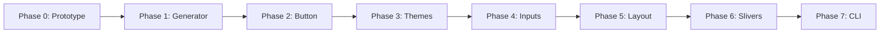

# Execution Roadmap

> Phased implementation plan with dependencies, milestones, and deliverables.

---

## Overview

```
Phase 0 ──► Phase 1 ──► Phase 2 ──► Phase 3 ──► Phase 4 ──► Phase 5 ──► Phase 6 ──► Phase 7
Manual      Generator   First       Multi       Complex     Layout      Slivers     CLI
Prototype   Foundation  Component   Theme       Inputs      System      Advanced    Product
   ✅          🔄          ⬜          ⬜          ⬜          ⬜          ⬜          ⬜
```

---

## Phase 0: Manual Prototype ✅ COMPLETE

**Duration:** 1 week
**Status:** Done

### Deliverables
- [x] Manual `meta_arch.dart` with Token + Spec + Renderer
- [x] Working demo with style switching
- [x] 4 components: Button, Badge, Card, Input
- [x] 3 styles: Material, Cupertino, Neo
- [x] Widget tests passing

### Outcome
Validated that the architecture works manually. Ready for automation.

---

## Phase 1: Generator Foundation 🔄 IN PROGRESS

**Duration:** 2 weeks
**Dependencies:** Phase 0

### Tasks
- [ ] Create `/generator` Dart console app
- [ ] Define meta file schema (`@MetaComponent` annotation)
- [ ] Implement basic file parser
- [ ] Implement template engine
- [ ] Generate single component from meta definition
- [ ] CLI: `meta_gen build`

### Deliverables
- [ ] `meta_gen` CLI that runs
- [ ] Generates `AppButton` from `button.meta.dart`
- [ ] Output matches manual implementation quality

### Success Criteria
```bash
$ meta_gen build --component=button
✓ Generated lib/generated/app_button.dart
```

---

## Phase 2: First Component (Button)

**Duration:** 1 week
**Dependencies:** Phase 1

### Tasks
- [ ] Full button implementation with all state tokens
- [ ] Variant support (primary, secondary, ghost)
- [ ] Disabled state handling
- [ ] Loading state handling
- [ ] Generated tests

### Deliverables
- [ ] `AppButton` widget with full API
- [ ] Golden tests for each variant/state
- [ ] Documentation generated

---

## Phase 3: Multi-Theme Support

**Duration:** 2 weeks
**Dependencies:** Phase 2

### Tasks
- [ ] Theme configuration file (`meta_gen.yaml`)
- [ ] Token resolution per theme
- [ ] Runtime theme switching (`--mode=dynamic`)
- [ ] Static theme compilation (`--mode=static`)
- [ ] `AppTheme` InheritedWidget generation

### Deliverables
- [ ] 3 themes working: Material, Cupertino, Neo
- [ ] Theme switching demo app
- [ ] Performance benchmarks

### Success Criteria
```bash
$ meta_gen build --mode=dynamic --themes=material,cupertino,neo
✓ Generated 3 theme variants
```

---

## Phase 4: Complex Input Components

**Duration:** 2 weeks
**Dependencies:** Phase 3

### Tasks
- [ ] `AppInput` with focus states
- [ ] `AppTextArea` (multiline)
- [ ] Error state styling
- [ ] Validation rule generation
- [ ] Form integration pattern

### Deliverables
- [ ] Full input component suite
- [ ] Form example with validation
- [ ] State management integration docs

---

## Phase 5: Layout System

**Duration:** 3 weeks
**Dependencies:** Phase 4

### Tasks
- [ ] `AppRow` / `AppColumn` with gap tokens
- [ ] `AppStack` for positioning
- [ ] `AppContainer` with constraints
- [ ] Responsive breakpoint support
- [ ] Spacing scale enforcement

### Deliverables
- [ ] Layout primitives generated
- [ ] Responsive demo
- [ ] Migration guide from raw Flutter

---

## Phase 6: Advanced Layouts (Slivers)

**Duration:** 3 weeks
**Dependencies:** Phase 5

### Tasks
- [ ] `AppScrollView` wrapping CustomScrollView
- [ ] `AppSliverList` / `AppSliverGrid`
- [ ] `AppSliverHeader` (app bar)
- [ ] Performance optimization
- [ ] Lazy loading patterns

### Deliverables
- [ ] Sliver component suite
- [ ] Performance benchmarks vs raw Flutter
- [ ] Example: Complex scrolling screen

---

## Phase 7: CLI Productization

**Duration:** 2 weeks
**Dependencies:** Phase 6

### Tasks
- [ ] `meta_gen init` - project scaffolding
- [ ] `meta_gen add <component>` - add new component
- [ ] `meta_gen migrate` - schema upgrades
- [ ] `meta_gen doctor` - health check
- [ ] pub.dev publishing

### Deliverables
- [ ] Published package on pub.dev
- [ ] Full CLI documentation
- [ ] Getting started guide
- [ ] Example repositories

---

## Dependency Graph



---

## Risk Points

| Phase | Risk | Mitigation |
|-------|------|------------|
| Phase 1 | Template engine complexity | Start with string interpolation |
| Phase 3 | Performance overhead | Benchmark early, static mode |
| Phase 5 | Responsive complexity | Support progressive adoption |
| Phase 6 | Sliver abstraction | Allow escape hatch to raw |

---

## Time Estimate

| Phase | Duration | Cumulative |
|-------|----------|------------|
| Phase 0 | 1 week | 1 week ✅ |
| Phase 1 | 2 weeks | 3 weeks |
| Phase 2 | 1 week | 4 weeks |
| Phase 3 | 2 weeks | 6 weeks |
| Phase 4 | 2 weeks | 8 weeks |
| Phase 5 | 3 weeks | 11 weeks |
| Phase 6 | 3 weeks | 14 weeks |
| Phase 7 | 2 weeks | 16 weeks |

**Total: ~4 months to full MVP**

---

*Document Version: 2.0*
